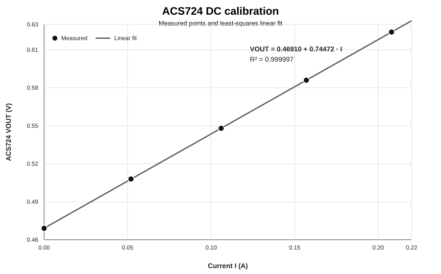

# 16 — ACS724 DC Calibration

**Status:** Stage B bench characterization result  
**Date:** 2026-09-07  
**Applies to:** Pololu #4048 ACS724LLCTR-05AU, Arduino-powered signal side, bench resistive current load

## 1. Purpose

The purpose of this experiment was to verify the ACS724 current-sensor DC transfer behavior with a known, stable current before using the sensor for dynamic motor-current measurements.

The experiment was designed to answer four questions:

1. Does the high-current path through the ACS724 conduct correctly?
2. Does `VOUT` increase monotonically with current in the expected current direction?
3. What zero-current offset is observed in the present bench setup?
4. What practical sensitivity is obtained from measured data?

This test intentionally used a resistor load instead of the motor so that current could be predicted directly from Ohm's law and checked against the bench-PSU indication.

---

## 2. Relevant hardware

- current sensor: Pololu #4048 ACS724LLCTR-05AU, unidirectional 0–5 A carrier
- controller / sensor supply: Arduino UNO R4 WiFi
- bench PSU: Jesverty SPS-3010V
- multimeter: VC830L
- load resistors: BOJACK 56 Ω, 1%, 1/4 W metal-film resistors
- solderless breadboard

The ACS724 signal side was powered from the Arduino:

`Arduino 5 V → ACS724 VCC`

`Arduino GND → ACS724 GND`

The multimeter measured:

`red probe → ACS724 OUT`

`black probe → ACS724 GND`

The high-current path was:

`PSU+ → ACS724 IP+ → ACS724 IP− → resistor load → PSU−`

The motor was removed from the calibration circuit.

---

## 3. Pre-test troubleshooting and safety findings

Before this calibration, Windows repeatedly reported a USB-port power-surge warning while the Arduino was connected with external breadboard wiring.

The fault-isolation sequence was:

1. disconnect Arduino USB
2. remove all external Arduino wiring
3. reconnect the bare Arduino only
4. confirm that the USB warning disappeared
5. verify breadboard continuity with the circuit unpowered
6. verify power-rail isolation
7. verify ACS724 `VCC–GND`, `OUT–GND`, and `OUT–VCC` had no direct continuity short
8. rebuild the sensor wiring one connection at a time

The warning did not recur after the circuit was rebuilt correctly.

Engineering conclusion:

**The USB overcurrent warning was associated with the external wiring state, not with normal operation of the bare Arduino.**

This established a Stage B bench rule:

**When a suspected short or overcurrent event occurs, isolate the source while unpowered and rebuild one verified connection at a time.**

---

## 4. Breadboard verification

The breadboard topology was verified experimentally using the multimeter continuity function.

Observed:

- `f2 ↔ j2`: continuity present
- `f2 ↔ f3`: no continuity
- same positive power rail, separated points: continuity present
- same negative power rail, separated points: continuity present
- positive rail ↔ negative rail: no continuity

This confirmed that the numbered `f–j` groups were internally common by row and that adjacent rows and opposite rails were isolated.

The ACS724 logic pins were installed as:

- `j1` = OUT
- `j2` = VCC
- `j3` = GND

With the ACS724 inserted, the same no-short behavior remained between its logic pins.

---

## 5. Sensor-side preliminary measurements

With the ACS724 powered from the Arduino and no measurement current applied:

- measured `VCC–GND`: **4.65 V**
- measured `OUT–GND`: approximately **0.48–0.49 V** during initial checks

The current project rule remains that these are raw bench readings. The earlier PSU-versus-multimeter comparison showed an indication discrepancy near 5 V, but no formal multimeter calibration has been performed.

Therefore the 4.65 V reading shall not be silently corrected.

---

## 6. Current-direction check

With the motor initially used as a small load, reversing the ACS724 high-current path changed the sensor output direction.

One observed reversed-direction condition at approximately 35 mA produced:

`VOUT ≈ 0.43 V`

Restoring the intended current direction returned the output toward the zero-current level.

This confirmed that the sensor was responding to current direction and reinforced the intended wiring:

`PSU+ → IP+ → IP− → load → PSU−`

Because this ACS724 variant is unidirectional, the calibration was performed only in the direction that increases `VOUT` above the zero-current offset.

---

## 7. Resistive calibration load design

Three 56 Ω, 1/4 W resistors were first placed in parallel on the breadboard.

Measured equivalent resistance:

`R_eq,3 = 18.8 Ω`

Ideal value:

`56 Ω / 3 = 18.67 Ω`

The measured value is consistent with the resistor values and meter resolution.

At 3.00 V, predicted current for the three-resistor load is:

`I = V / R = 3.00 / 18.8 = 0.1596 A`

The PSU indicated approximately:

`I = 0.157–0.158 A`

which closely agrees with the Ohm's-law prediction.

For one 56 Ω branch at 3.00 V:

`I_branch = 3.00 / 56 = 53.6 mA`

and resistor dissipation is:

`P_branch = V² / R = 3.00² / 56 = 0.161 W`

Each resistor is rated at 0.25 W, therefore:

`0.161 W < 0.25 W`

The individual resistors were operated below their nominal power rating, although noticeable warming is still possible and long unattended operation is not intended.

---

## 8. Raw calibration data

The PSU was held at **3.00 V**. Current was changed by using 0 to 4 identical 56 Ω resistors in parallel.

| Parallel 56 Ω resistors | PSU current (A) | PSU power (W) | ACS724 VOUT (V) |
|---:|---:|---:|---:|
| 0 | 0.000 | 0.000 | 0.469 |
| 1 | 0.052 | 0.156 | 0.508 |
| 2 | 0.106 | 0.318 | 0.548 |
| 3 | 0.157 | 0.468 | 0.586 |
| 4 | 0.208 | 0.624 | 0.624 |

The PSU powers above are the observed display values recorded during the test.

The measured current progression is close to the expected approximately 53.6 mA increment per added 56 Ω branch.

---

## 9. Linear fit

The measured data were fitted with the first-order model:

`VOUT = V0 + S·I`

Least-squares fit result:

`VOUT = 0.46910 + 0.74472·I`

where:

- `VOUT` is in volts
- `I` is in amperes
- fitted zero-current intercept `V0 = 0.46910 V`
- fitted sensitivity `S = 0.74472 V/A = 744.72 mV/A`

Coefficient of determination:

`R² = 0.999997`

This demonstrates very strong linearity over the tested range from 0 A to 0.208 A.

The inverse conversion for this measured bench condition is:

`I = (VOUT - 0.46910) / 0.74472`

This equation is a **bench calibration result for the present sensor/supply/instrument condition**, not yet a universal production calibration constant.

---

## 10. Residuals from the fitted line

| Current (A) | Measured VOUT (V) | Fit VOUT (V) | Residual (mV) |
|---:|---:|---:|---:|
| 0.000 | 0.469 | 0.469103 | -0.103 |
| 0.052 | 0.508 | 0.507828 | +0.172 |
| 0.106 | 0.548 | 0.548043 | -0.043 |
| 0.157 | 0.586 | 0.586023 | -0.023 |
| 0.208 | 0.624 | 0.624004 | -0.004 |

The residuals are much smaller than 1 mV. They should not be overinterpreted as sensor accuracy because the multimeter resolution, PSU indication accuracy, resistor tolerance, sensor supply uncertainty, temperature, and other bench uncertainties have not yet been combined into a formal calibration uncertainty budget.

The residuals do, however, show that the measured points are extremely close to a straight line.

---

## 11. Calibration graph

The graph plots the five measured points and the least-squares linear fit.

---

## 12. Comparison with nominal sensitivity

The nominal sensitivity used previously for prediction was approximately:

`S_nom ≈ 0.8 V/A`

The measured slope was:

`S_meas = 0.74472 V/A`

Relative difference from the simple nominal value:

`(0.74472 - 0.8) / 0.8 × 100% ≈ -6.9%`

This difference must not yet be classified as a sensor fault.

Possible contributors include:

- actual sensor VCC differing from the 5 V nominal condition
- sensor gain tolerance
- multimeter indication error / resolution
- PSU current-indication accuracy
- resistor tolerance and temperature rise
- temperature dependence of sensor offset and sensitivity
- contact and wiring resistance

A later higher-quality calibration should measure the sensor supply and output with a better-characterized reference instrument and should include uncertainty explicitly.

---

## 13. Important measurement mistake captured during the experiment

At one point, the multimeter was accidentally connected between `OUT` and `VCC` instead of between `OUT` and `GND`.

The meter displayed approximately:

`-4.07 V`

This was not a negative ACS724 output voltage. It was the voltage difference between the two probe locations.

For example, with approximately:

`VOUT ≈ 0.57–0.59 V`

and

`VCC ≈ 4.65 V`

then:

`VOUT - VCC ≈ -4.06 to -4.08 V`

which explains the observed reading.

Engineering lesson:

**A voltmeter measures potential difference between its red and black probes. A statement such as “the voltage at OUT” is incomplete unless the reference node is also stated.**

For this project, sensor-output measurements shall be written explicitly as `VOUT-to-GND` unless another reference is intentionally used.

---

## 14. PSU current-limit lesson

The calibration was performed with a PSU current limit of approximately **0.5 A**.

The maximum measured load current was:

`0.208 A`

which remained below the configured limit.

The PSU current limit is a protection mechanism: if the connected load attempts to draw more current than the configured limit, the supply should leave normal constant-voltage operation and reduce output voltage as required to limit current.

However:

**Current limiting is not a substitute for correct wiring.**

Short circuits or incorrect connections can still create local heating, connector stress, component damage, or USB-port protection events. Wiring verification remains mandatory before power is applied.

---

## 15. Engineering conclusions

The experiment establishes the following Stage B results:

1. The ACS724 signal side can be powered successfully from the Arduino in the present bench arrangement.
2. The high-current path operates correctly in the intended direction.
3. The sensor output increases monotonically with current over the tested 0–208 mA range.
4. The measured zero-current intercept is approximately **0.469 V** for this calibration run.
5. The measured DC sensitivity is approximately **0.745 V/A**.
6. The transfer is extremely linear over the tested range, with `R² ≈ 0.999997`.
7. The resistor-load current agrees closely with Ohm's-law prediction and PSU indication.
8. The ACS724 is therefore suitable to proceed to controlled motor-current measurement and later dynamic waveform capture.

This is the first deliberate bench calibration of the current-sensing chain in Stage B.

---

## 16. Limitations

This result does **not** yet establish:

- production calibration accuracy
- full 0–5 A behavior
- dynamic bandwidth
- startup-current peak accuracy
- temperature drift
- long-term offset stability
- Arduino ADC conversion accuracy
- total system measurement uncertainty
- behavior after analog filtering

The tested current range was only 0–0.208 A.

The present fit should therefore be treated as a verified low-current bench calibration, not as final product calibration.

---

## 17. Next actions

Recommended next sequence:

1. repeat zero-current reading before and after the next test to observe short-term offset drift
2. route the motor current through the ACS724 in the validated direction
3. record simultaneous PSU current and ACS724 DC output at steady motor operation
4. convert sensor output to current using the measured calibration equation and compare with PSU indication
5. connect the oscilloscope to `ACS724 OUT-to-GND`
6. capture motor startup current as a time-domain waveform
7. separate true motor-current dynamics from PSU turn-on behavior already identified in B-005
8. later introduce Arduino ADC acquisition only after the analog sensor behavior is understood

The immediate next engineering objective is therefore **validated motor-current measurement using the now-calibrated ACS724 chain**.
