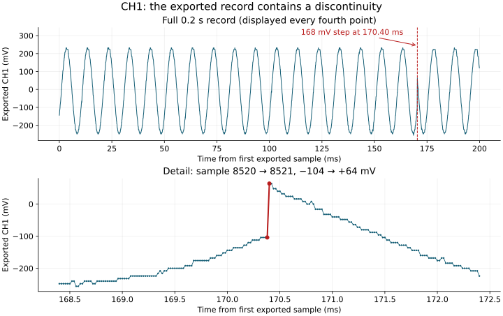

# 100 Hz Average-64 CSV check — 2026-09-14

**Finding:** CH1 contains a phase discontinuity at 170.4 ms. A single stationary sine fit across this record is unsuitable for accepting sensor gain. The cause may be a real transient or an acquisition/export effect; these files alone do not distinguish them.

The user reported CH1 stable at 480 mVpp after the Sample instruction, then rising from approximately 100 to 475 mVpp after selecting Average 64 and appearing stable. This CSV pair followed that report. The 100 Hz setting was explicitly confirmed. The filenames include 2pp; a fresh generator amplitude measurement was not provided.

## Files and provenance

The archived CSV files retain the original uploaded bytes, including line endings.

| Channel | Original file | SHA-256 |
| --- | --- | --- |
| CH1 | [data_27_000_CH1_avg100Hz_2pp.csv](../../raw/2026-09-14/data_27_000_CH1_avg100Hz_2pp.csv) | `0232a79e041c727434beb9e28c0956ef6659507fa825931b9ee3c2426c97e805` |
| CH2 | [data_27_001_CH2_avg100Hz_2pp.csv](../../raw/2026-09-14/data_27_001_CH2_avg100Hz_2pp.csv) | `17e527fb7f1c2e3cf3a7571fde9f91a140c4fc79d04d012d806c4836c09706a7` |

Each file contains 10,000 consecutive samples, spaced 20 µs apart. The exported rate is 50,000 points/s; the first-to-last span is 0.19998 s. Time in this analysis starts at the first exported sample, not at an independently established trigger timestamp. The CSV headers do not identify the acquisition mode or confirm whether the scope was stopped during export.

## Readout versus saved samples

| Quantity | CH1 | CH2 |
| --- | ---: | ---: |
| CSV header Vpp | 479.5 mV | 82.00 mV |
| Maximum minus minimum of exported samples | 488 mV | 236 mV |
| Smallest spacing between distinct exported voltage levels | 8 mV | 4 mV |
| Header voltage per ADC value | 0.5 mV | 0.25 mV |
| Mean of exported values | −7.9304 mV | 203.3836 mV |

These differences are recorded, not corrected. They do not establish which processing stage the CSV represents or prove a firmware defect. In particular, the CH2 mean in the file must not replace the previously reported physical OUT-to-GND reading of 0.498 V.

## The discontinuity

Between one-based sample indices **8520 and 8521**, CH1 changes from **−104 mV to +64 mV** in one exported interval: a **168 mV step**.



Plot voltages are the CSV's stored coordinates. The full-record panel shows every fourth point for clarity; the detail panel and calculations use every sample.

The following fits diagnose the record. Splitting at the jump does not repair the original evidence or turn either section into an accepted calibration result.

| CH1 interval | Independently fitted frequency | Fitted sine Vpp | Residual RMS |
| --- | ---: | ---: | ---: |
| Samples 1–8520 | 99.99895 Hz | 477.510 mV | 4.286 mV |
| Samples 8521–10000 | 100.01418 Hz | 476.617 mV | 4.321 mV |
| Whole record, single sine | 99.05844 Hz | 340.069 mV | 118.640 mV |

Both sections have amplitudes close to the settled screen reading. At a fixed 100 Hz, their fitted phases differ by approximately 186.4° (equivalently −173.6°). Their partial cancellation explains why a whole-record sine fit reports a much smaller amplitude. The whole-record fitted frequency near 99.06 Hz is not evidence that the generator was set incorrectly.

## What can be said about CH2

At a fixed 100 Hz:

| Interval used diagnostically | Fitted CH2 sine Vpp | CH2 residual RMS |
| --- | ---: | ---: |
| Samples 1–8520 | 5.332 mV | 21.917 mV |
| Samples 8521–10000 | 6.705 mV | 21.775 mV |
| Whole record | 3.541 mV | 21.949 mV |

The residual is much larger than the sine component. These figures depend on the chosen interval and have not been assigned calibration uncertainty. Equal exported indices alone do not establish simultaneous channel capture; no cross-channel phase calibration is claimed.

For scale, the settled CH1 readout of 475 mVpp through measured R8 = 67 Ω implies approximately 7.09 mApp. Nominal sensor sensitivity of 0.8 V/A predicts approximately **5.67 mVpp** at CH2. The diagnostic result is of that order, but **no sensor gain is accepted from this pair**.

## Method and reproduction

[check_average_csv.py](check_average_csv.py) reads the unchanged raw files and writes [metrics.json](metrics.json) and the plot. It requires Python with NumPy, SciPy, and Matplotlib.

From the repository root:

```bash
python docs/evidence/analysis/2026-09-14/check_average_csv.py
```

The model is `y(t) = c + a·sin(2πft) + b·cos(2πft)`. Linear least squares determines c, a, and b at each frequency; fitted Vpp is `2·sqrt(a²+b²)`. CH1's free frequency uses a 95–105 Hz grid search followed by bounded minimization around its best grid point. Residual RMS is computed from all samples in the stated interval.

The largest absolute CH1 sample step defines the two diagnostic intervals. No rows are removed, reordered, or overwritten. The CSV header ADC factor is not applied again: the voltage column already declares mV. Raw Vpp and fitted sine Vpp are kept distinct.

## Next controlled check

Keep the generator at **100 Hz** and acquisition at **Average 64**. After the displayed waveforms settle, ensure acquisition status is **STOP** (use Run/Stop only if running). Export both channels from that same stopped record, without restarting acquisition between files.

**Purpose:** Freeze the acquisition while exporting, to test whether updating data contributes to the discontinuity. Whether the present files were exported while running is unknown.

**Expected evidence:** A continuous CH1 record whose fitted amplitude is consistent with the settled display. If the jump remains in a confirmed stopped export, investigate the acquisition/export path or a real transient without silently trimming the record.

See the [acquisition lesson and bench sequence](../../../../study/oscilloscope-acquisition-and-triggering.md) for the settings and their purpose.
