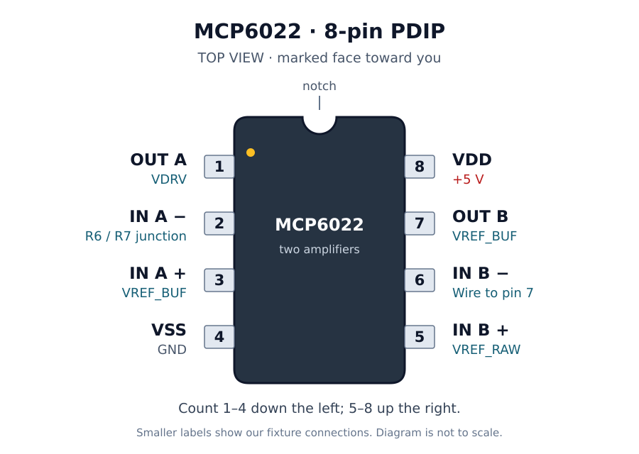

# MCP6022 Pinout and Its Role in the Fixture

Actuator Health Monitoring System — study note, 2026-09-13.

The breadboard device is the **8-pin PDIP MCP6022**. It contains two operational amplifiers, A and B, which share the same supply connections.

## Find pin 1 on the physical device

Look down at the marked top of the package. Orient the semicircular notch toward the top of the diagram. Pin 1 is at the upper left; a pin-1 dot, when present, is beside that corner. Count counterclockwise: **1–4 down the left side, then 5–8 up the right side**. Use the notch or pin-1 indicator to establish orientation.

This is a top view. Rotating the chip rotates this map; the electrical pin numbers stay fixed.

Pin identities and package orientation are checked against Microchip's package diagram and Table 3-1. [MCP6022 family datasheet, pages 1 and 15](https://ww1.microchip.com/downloads/en/DeviceDoc/20001685E.pdf)

## Every pin, and our connection

| Pin | Datasheet name | Meaning | Connection in our fixture |
| --- | --- | --- | --- |
| 1 | VOUTA | Amplifier A output | `VDRV`: drives R5 and connects to feedback resistor R7 |
| 2 | VINA− | A inverting input | Junction of R6 (`RIN`) and R7 (`RF`) |
| 3 | VINA+ | A non-inverting input | `VREF_BUF`, supplied by pin 7 |
| 4 | VSS | Lower supply rail | PSU GND |
| 5 | VINB+ | B non-inverting input | `VREF_RAW`, junction of divider resistors R3 and R4 |
| 6 | VINB− | B inverting input | Connected directly to pin 7 for buffer feedback |
| 7 | VOUTB | Amplifier B output | `VREF_BUF`: connects to pins 6 and 3 |
| 8 | VDD | Upper supply rail | PSU +5 V |

The last column is derived from the [project schematic](../Schematics/actuator-health/actuator-health.kicad_sch). Pin 7 becomes our reference output because of the external wiring.

## What + and − mean on an amplifier

The input signs describe how a voltage difference influences the output. For amplifier A, increasing pin 3 relative to pin 2 pushes the output upward; increasing pin 2 relative to pin 3 pushes it downward. The same relationship applies to B's pins 5 and 6.

These are analog voltage inputs. The minus sign does not mean “connect this input to ground” or require a negative voltage.

A useful simplified model is:

`Vout = Aopen-loop × (V+ − V−)`

The open-loop gain is large. With suitable negative feedback and operation within the amplifier's limits, a small input difference makes the output settle. This is why we often calculate using **V− ≈ V+**. Feedback creates this approximate equality; the two input pins are not internally shorted.

## Amplifier B: why pins 6 and 7 are joined

R1–R4 form the reference divider. With four equal resistors and a 5 V supply:

`VREF_RAW = 5 V × R4 / (R1 + R2 + R3 + R4) = 1.25 V`

Pin 5 senses this voltage. Pin 6 senses the output because it is connected to pin 7.

If pin 7 is too low, pin 5 is above pin 6 and the amplifier drives pin 7 upward. If pin 7 is too high, feedback drives it downward. It settles near the reference voltage.

The divider supplies very little input current to pin 5. The buffer supplies its connected load from the IC's power rails, keeping loading of the divider small.

Ideally:

`pin 5 ≈ pin 6 = pin 7 ≈ 1.25 V`

Pins 6 and 7 are equal because of their wire connection. The approximate equality to pin 5 depends on correct powered operation and feedback.

## Amplifier A: why pin 2 receives two resistors

Pin 3 sets the reference at `VREF_BUF`. R6 carries the generator input toward pin 2; R7 feeds the output back to that junction.

Using negligible input current and `V(pin 2) ≈ VREF_BUF`, Kirchhoff's current law gives:

`(AFG_IN − VREF_BUF)/R6 + (VDRV − VREF_BUF)/R7 ≈ 0`

Rearranging:

`VDRV ≈ (1 + R7/R6) × VREF_BUF − (R7/R6) × AFG_IN`

For equal R6 and R7:

`VDRV ≈ 2 × VREF_BUF − AFG_IN ≈ 2.5 V − AFG_IN`

An increase at the generator input causes a decrease at pin 1. This approximation applies while the amplifier can supply the required output voltage and current.

Pin 1 drives the series path through R5, Pololu IP+ to IP−, and R8 to ground. Scope CH1 measures the voltage across R8; scope CH2 measures the separate Pololu OUT signal. Scope channel numbers do not identify the MCP6022's internal amplifiers.

## Supply pins and the capacitor

In our single-supply circuit, **pin 8 = +5 V and pin 4 = GND**. VSS denotes the lower supply rail; here it is 0 V. The specified operating supply difference is 2.5–5.5 V. [Microchip datasheet, section 3.5](https://ww1.microchip.com/downloads/en/DeviceDoc/20001685E.pdf)

C1, 100 nF, connects the pin-8 supply node to the pin-4 ground node. Its short local connections let it supply brief current changes and reduce rapid disturbance of the IC's supply. It sits across the rails, while pin 8 also has its direct supply wire. [Microchip supply bypass guidance, section 4.7](https://ww1.microchip.com/downloads/en/DeviceDoc/20001685E.pdf)

The earlier missing pin-8 supply connection and missing divider supply connection were different faults. Powering the IC enables the amplifiers; powering the divider establishes the reference they use.

## Why KiCad shows U1A, U1B, and U1C

These symbols describe **one physical chip**:

| KiCad unit | Physical pins | Role here |
| --- | --- | --- |
| U1A | 1, 2, 3 | Biased inverting driver |
| U1B | 5, 6, 7 | Reference buffer |
| U1C | 8, 4 | Shared power connections |

U1C is the supply symbol, so the drawing still represents two amplifiers and eight physical pins.

The `VREF_RAW` and `VREF_BUF` names belong to our external circuit. The MCP6022 has no dedicated VREF pin; the family datasheet also describes other devices that do. [Microchip datasheet, Table 3-1](https://ww1.microchip.com/downloads/en/DeviceDoc/20001685E.pdf)

## Match the package to the breadboard

With power disconnected when repositioning the IC, place the package across the breadboard's center trench. Its two rows of legs belong on opposite sides of the trench, and successive pins on each side occupy different numbered rows. Breadboard row numbers are not IC pin numbers.

For voltage measurements, name both points explicitly, for example **“MCP6022 pin 7 relative to circuit GND.”** Record the instrument and whether the quantity is DC, RMS, or peak-to-peak.

Continue with [oscilloscope acquisition and triggering](oscilloscope-acquisition-and-triggering.md) to understand how those voltages become waveform records.
